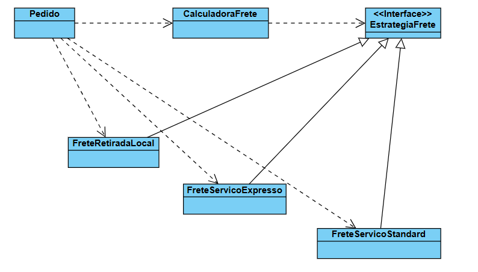

# Padrão Strategy: Cálculo de Frete

Este é um projeto de exemplo em Java que demonstra a implementação do padrão de projeto comportamental **Strategy**. O objetivo é criar um sistema flexível para calcular o custo de frete de um pedido, permitindo que o algoritmo de cálculo seja alterado em tempo de execução.

## O Problema

Imagine que um sistema de e-commerce precisa calcular o custo do frete de um pedido. No entanto, existem várias formas de envio, cada uma com sua própria regra de cálculo:

* **Frete Standard:** Um cálculo-base mais um valor por peso e por distância.
* **Frete Expresso:** Um cálculo-base mais caro, com multiplicadores maiores por peso e distância.
* **Retirada Local:** Custo zero, independentemente do peso ou distância.

Implementar isso com uma série de `if/else` ou `switch` dentro da classe `Pedido` tornaria o código complexo e difícil de manter.

## A Solução: Padrão Strategy

O padrão Strategy resolve isso encapsulando cada um desses algoritmos de cálculo em sua própria classe.

1.  **Contexto (Context):** A classe que precisa do algoritmo (ex: `CalculadoraFrete`).
2.  **Estratégia (Strategy):** Uma interface comum que define o método que os algoritmos devem implementar (ex: `EstrategiaFrete`).
3.  **Estratégias Concretas (Concrete Strategies):** As classes que implementam a interface, cada uma com sua própria lógica (ex: `FreteServicoStandard`, `FreteServicoExpresso`).

## Estrutura do Projeto

### Componentes Principais

* **EstrategiaFrete**: Define o contrato `calcularCusto(peso, distancia)`.
* **FreteServicoStandard**: Implementa `EstrategiaFrete` com a lógica de frete econômico.
* **FreteServicoExpresso**: Implementa `EstrategiaFrete` com a lógica de frete rápido.
* **FreteRetiradaLocal**: Implementa `EstrategiaFrete` retornando custo zero.
* **CalculadoraFrete**: Armazena os dados base (peso, distância). Possui um método `calcular(EstrategiaFrete estrategia)` que executa a estratégia fornecida.
* **Pedido**: A classe "cliente" que utiliza o contexto. Decide qual estratégia concreta será usada em um determinado momento.
  
 ## Diagrama de Classes
 
